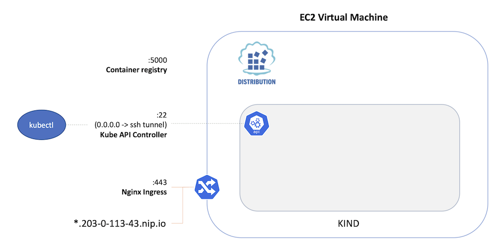

# Deploy a Kubernetes Cluster

[PREV: Setup](00-setup.md) <==> [NEXT: Deploy a Fabric Network](20-fabric.md)

---

When working with a cloud native Fabric stack, it is possible to connect the client application binaries
(`kubectl`, `peer`, `node`, etc.) to a Kubernetes cluster running on a remote virtual machine.  In this
scenario, you will provision a VM instance at EC2, install a KIND cluster on the VM, and forward a local
port to the remote API controller with SSH.  This configuration can be extremely useful in scenarios
where the local system does not have sufficient resources to "run everything," or when a local development
is focused on client-application development and Fabric needs to "just run somewhere."

This configuration is also an effective way to minimize usage costs associated with a "full Kubernetes"
deployment on cloud vendors, enabling a natural k8s development workflow on disposable, temporary VMs. 




## Provision a Virtual Machine Instance at EC2 

- Log in to AWS
- Use `t2.xlarge` profile (4 CPU / 8 GRAM / 80 GB gp2)
- open ports 80 (nginx), 443 (nginx), and 5000 (container registry)
- copy/paste `infrastructure/ec2-cloud-config.yaml` as the instance user-data
- Create an ssh key pair for remote login.  Save locally as `~/Downloads/ec2-key.pem`
- After the instance is up, identify the PUBLIC IPV4 address.  This will be used extensively for all access to the cluster:


```shell

# Set to your EC2 instance Public IPv4 address and SSH connection key.  E.g.:
export EC2_INSTANCE_IP=203.0.113.42
export EC2_INSTANCE_KEY=~/Downloads/ec2-key.pem

```

```shell

# Set the workshop IP address for access to the Nginx ingress controller 
WORKSHOP_IP=$EC2_INSTANCE_IP

```


## Start a KIND Cluster

- Open a new shell and connect to the VM
```shell

ssh -i $EC2_INSTANCE_KEY ubuntu@${EC2_INSTANCE_IP}

```

```shell

git clone https://github.com/hyperledgendary/full-stack-asset-transfer-guide.git
cd full-stack-asset-transfer-guide 

# Bind a docker container registry to the VM's external IP  
export CONTAINER_REGISTRY_ADDRESS=0.0.0.0
export CONTAINER_REGISTRY_PORT=5000

# Create a Kubernetes cluster in Docker, configure an Nginx ingress, and docker container registry
just kind 

```

```shell

# Observe the target Kubernetes workspace 
k9s -n test-network

```

---
[PREV: Setup](00-setup.md) <==> [NEXT: Deploy a Fabric Network](20-fabric.md)

