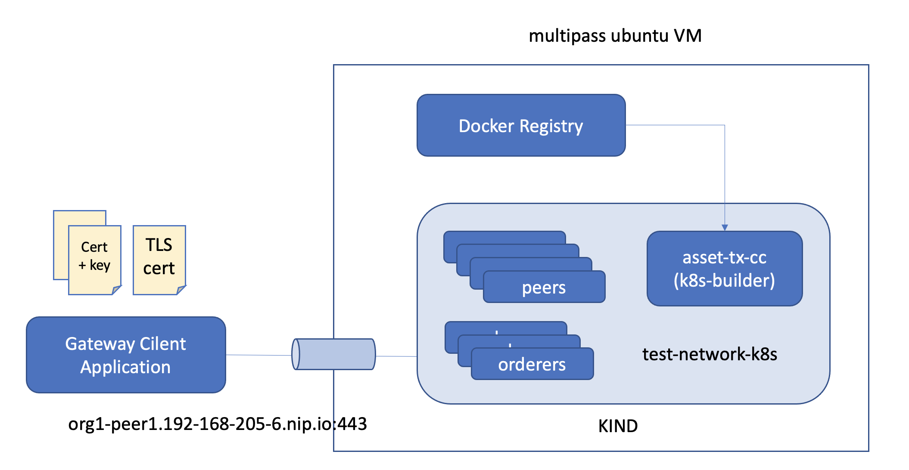

# Full stack with multipass and the Kubernetes Test Network

This scenario sets up a multipass VM with the kubernetes test network and an insecure docker registry.

Chaincode and application development is done locally on the HOST OS, connecting to the Fabric network 
via Nginx ingress.




## Download Fabric CLI binaries 

```shell
curl -sSL https://raw.githubusercontent.com/hyperledger/fabric/main/scripts/bootstrap.sh | bash -s -- -s -d
export PATH=$PWD/bin:$PATH

```


## Multipass VM

- scrub everything Fabric / k8s related on host os.

- install multipass
```shell
brew install --cask multipass
```

- create vm :
```shell
multipass launch \
  --name        fabric-dev \
  --disk        80G \
  --cpus        8 \
  --mem         8G \
  --cloud-init  infrastructure/multipass-cloud-config.yaml

multipass mount $PWD/config fabric-dev:/mnt/config 
```


## Test Network 

- open MP shell: 
```shell
multipass shell fabric-dev
sudo su - dev
```

- create a KIND cluster and install the test network 
```shell
# until PR #811 lands: 
# git clone https://github.com/hyperledger/fabric-samples.git
git clone https://github.com/jkneubuh/fabric-samples.git -b feature/k8s-builder-v7
```

```shell
cd ~/fabric-samples/test-network-k8s

export TEST_NETWORK_DOMAIN=$(hostname -I  | cut -d ' ' -f 1 | tr -s '.' '-').nip.io 
export TEST_NETWORK_CHAINCODE_BUILDER=k8s
export TEST_NETWORK_STAGE_DOCKER_IMAGES=false
export TEST_NETWORK_LOCAL_REGISTRY_INTERFACE=0.0.0.0
```

```shell
./network kind 
./network cluster init 
./network up
./network channel create 
```

- Transfer the network crypto material to the multipass volume mount 
```shell
cp -r build /mnt/config 
```

- Watch the target namespace 
```shell
k9s -n test-network 
```


### Install the Chaincode 

After the network has been set up in the multipass VM, all interaction will occur via the Ingress on port :443.
Open a new shell on the host OS: 

```shell
export TEST_NETWORK_DOMAIN=$(multipass info fabric-dev --format json | jq -r .info.\"fabric-dev\".ipv4[0])
```

- Set the peer context for the Org1 administrator: 
```shell
export FABRIC_CFG_PATH=$PWD/config
export CORE_PEER_LOCALMSPID=Org1MSP
export CORE_PEER_ADDRESS=org1-peer1.${TEST_NETWORK_DOMAIN}:443
export CORE_PEER_TLS_ENABLED=true
export CORE_PEER_MSPCONFIGPATH=$PWD/config/build/enrollments/org1/users/org1admin/msp
export CORE_PEER_TLS_ROOTCERT_FILE=$PWD/config/build/channel-msp/peerOrganizations/org1/msp/tlscacerts/tlsca-signcert.pem
```

- Build a docker image, upload to the docker registry, and prepare a k8s chaincode package:
```shell
export CHAINCODE_NAME=asset-tx-typescript
export CONTAINER_REGISTRY=$TEST_NETWORK_DOMAIN:5000
export CHAINCODE_IMAGE=$CONTAINER_REGISTRY/$CHAINCODE_NAME

docker build -t $CHAINCODE_IMAGE contracts/$CHAINCODE_NAME
docker push $CHAINCODE_IMAGE

IMAGE_DIGEST=$(docker inspect --format='{{index .RepoDigests 0}}' $CHAINCODE_IMAGE | cut -d'@' -f2)

infrastructure/pkgcc.sh -l $CHAINCODE_NAME -n localhost:5000/$CHAINCODE_NAME -d $IMAGE_DIGEST 
```

- Install the contract to org1-peer1: 
```shell
export VERSION=1
export SEQUENCE=1
```

```shell
peer lifecycle chaincode install ${CHAINCODE_NAME}.tgz 

export PACKAGE_ID=$(peer lifecycle chaincode calculatepackageid ${CHAINCODE_NAME}.tgz) && echo $PACKAGE_ID

peer lifecycle \
	chaincode approveformyorg \
	--channelID     mychannel \
	--name          ${CHAINCODE_NAME} \
	--version       ${VERSION} \
	--package-id    ${PACKAGE_ID} \
	--sequence      ${SEQUENCE} \
	--orderer       org0-orderer1.${TEST_NETWORK_DOMAIN}:443 \
	--tls --cafile  ${PWD}/config/build/channel-msp/ordererOrganizations/org0/orderers/org0-orderer1/tls/signcerts/tls-cert.pem \
	--connTimeout   15s

peer lifecycle \
	chaincode commit \
	--channelID     mychannel \
	--name          ${CHAINCODE_NAME} \
	--version       ${VERSION} \
	--sequence      ${SEQUENCE} \
	--orderer       org0-orderer1.${TEST_NETWORK_DOMAIN}:443 \
	--tls --cafile  ${PWD}/config/build/channel-msp/ordererOrganizations/org0/orderers/org0-orderer1/tls/signcerts/tls-cert.pem \
	--connTimeout   15s

```

```shell
peer chaincode query -n $CHAINCODE_NAME -C mychannel -c '{"Args":["org.hyperledger.fabric:GetMetadata"]}' | jq

```